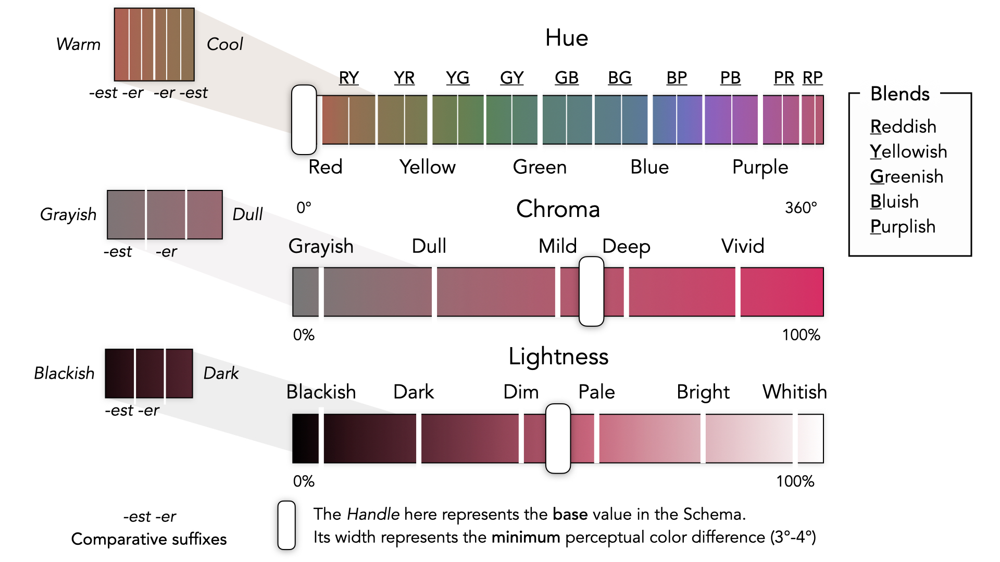

## 🍭 Chromataxy
**Chromataxy** (abbreviated ***coxy***) is a perceptually intuitive color naming system based on the ***Lightness Chroma Hue** color space* that covers a sizeable spectrum of colors while boasting a negligible learning curve. 

// screenshot

Look below to learn more or go straight to [documentation](#links-to-documentation). 

<a href="https://github.com/arvindcheenu">Made with ❤️ by <b>Arvind Srinivasan</b>.</a>
<b><small>Licensed Under <a href="https://github.com/arvindcheenu/Chromataxy/blob/master/LICENSE">Apache-2.0</a></small></b>.

#### 🔑 Key Features

* 👁️ **Perceptually uniform** colours
* 👌 **Semantically sound** names
* 🌐 **ii8n** friendly 
* ♿ **Visually Accessible** by design

### 🤔 Choice of Color Space

This library builds over the **HSLUV** Color Space that maps the boundaries of RGB Color Space to the perceptually uniform **CIELCHuv** Color Space, thus circumventing its problem of unbounded chroma. Though this leads to non-uniform chroma, the trade-off is less significant in comparison with other colorspaces: 
* **HSL**❓  While this transformation of RGB color space is more intuitive in its representation, the *lightness* in *HSL* does *not* represent *perceptual lightness* but rather *relative brightness*.
* **Munsell**❓ While colors were loosely based on perception, they were mostly inconsistent and dependent on the environment. Moreover, quantitative differences could only be defined over a single color attribute.
* **NCS**❓ Based on the psychophysics of color perception, *NCS* is better than *Munsell* as environmental lighting conditions do not impact color choices. However, this system must not be used to model perceived color differences, which is necessary requirement for a naming system to be accessible.
* **LAB**❓ Though the *CIELAB* color space represents a broader color gamut with better perceptual accuracy than the *Munsell* System, the parameters **a*** and **b*** makes it harder to arrive at a mental model.

### 🎨 Designing the Nomenclature of Color

The following schema was arrived at by extracting the best traits from existing naming solutions (such as the Five Color Primaries in *Munsell Naming System*) and selecting linguistically universal color terms. The incorporation of Adjective terms also enhances the learnability and composability by reducing the potential number of color terms to remember.

For a more detailed look at an object applying this schema, please see the file [`./lang/coxy.en.json`](./lang/coxy.en.json).

Besides the above considerations while designing the schema, the following were also looked for:
* The arrangement of terms according to increasing order of intensity in chroma and lightness while diverging from the base value of the schema (see *The Handle* in the above schema).
* The arrangement of Warm and Cool Ranges according to the gradatation of hues from adjacent hue sectors.

### 🔗 Links to Documentation
<h1>🚸</h1>[Installation & Usage](./docs/INSTALL.md)|<h1>💄</h1>[Sass Api](./docs/STYLE.md)|<h1>💻</h1>[Node Api](./docs/API.md)|<h1>🕹️</h1>[Command Line Api](./docs/CLI.md)|
|--|--|--|--|