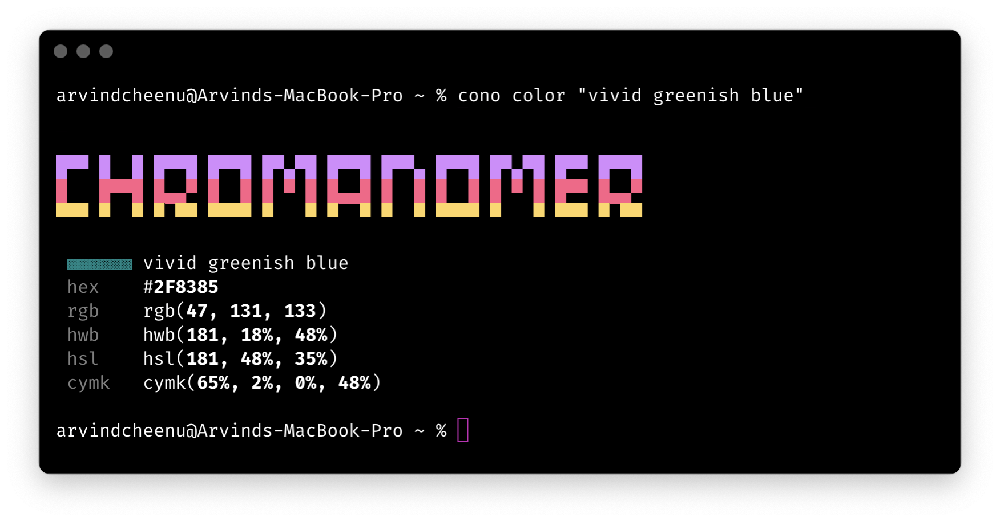
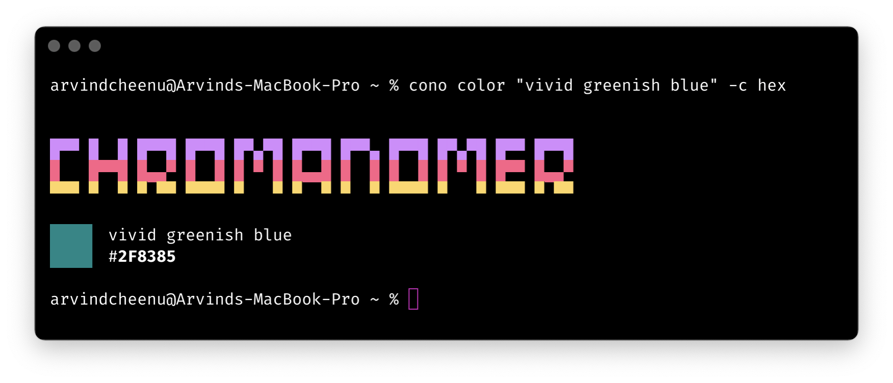
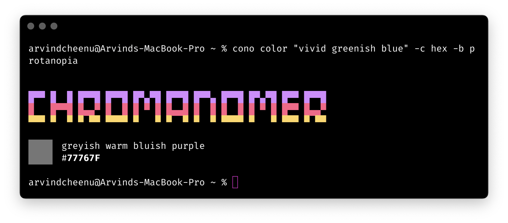
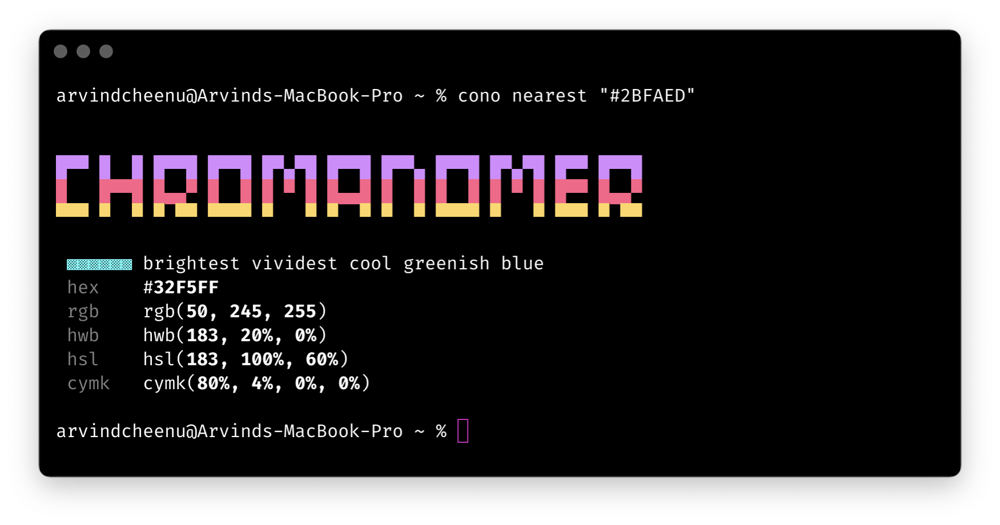
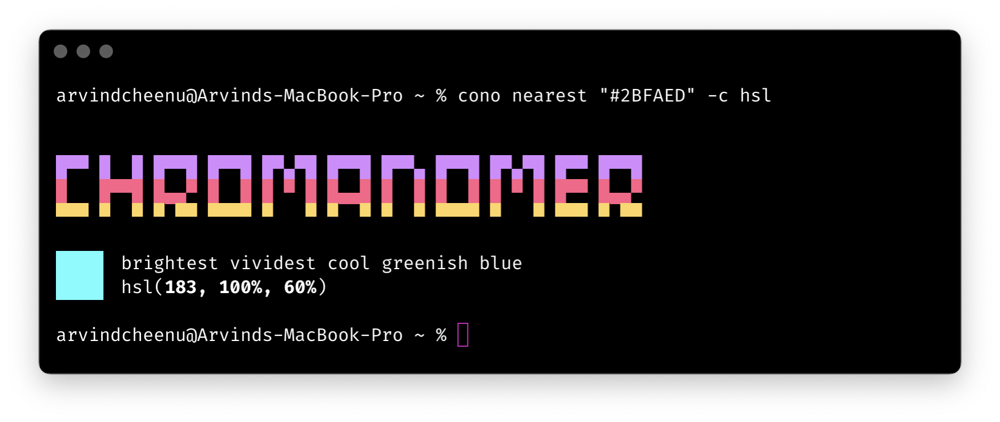
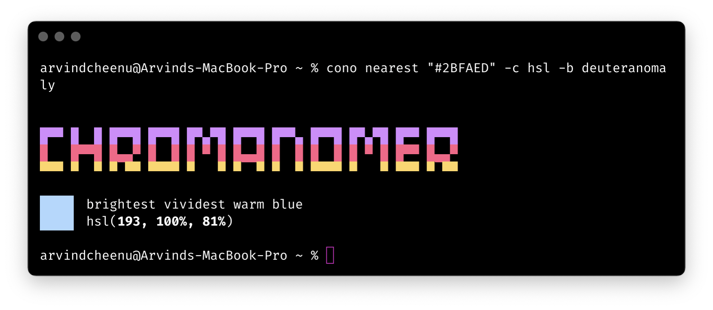
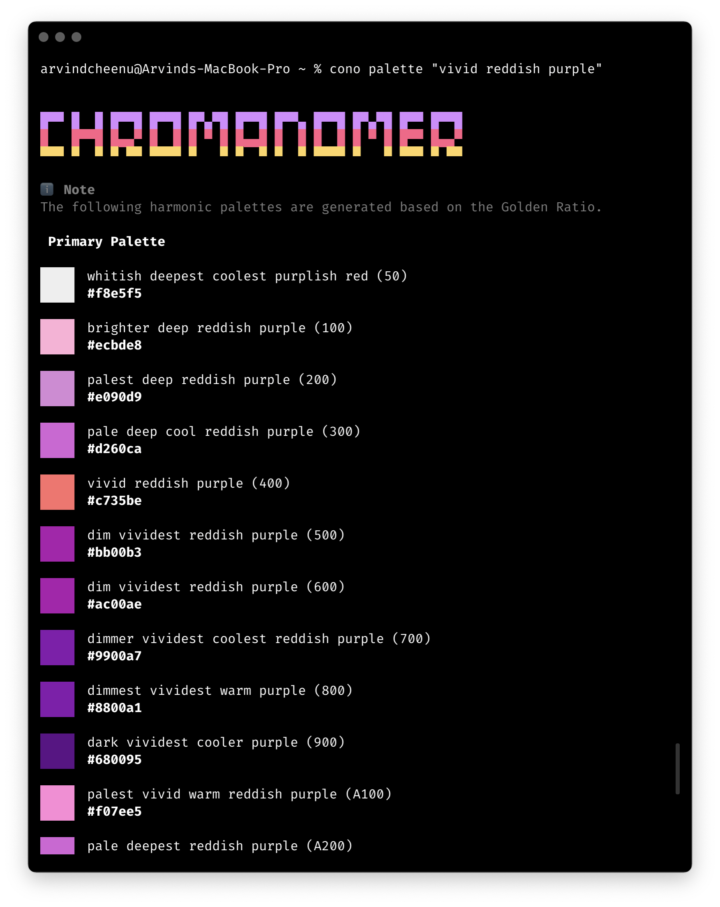
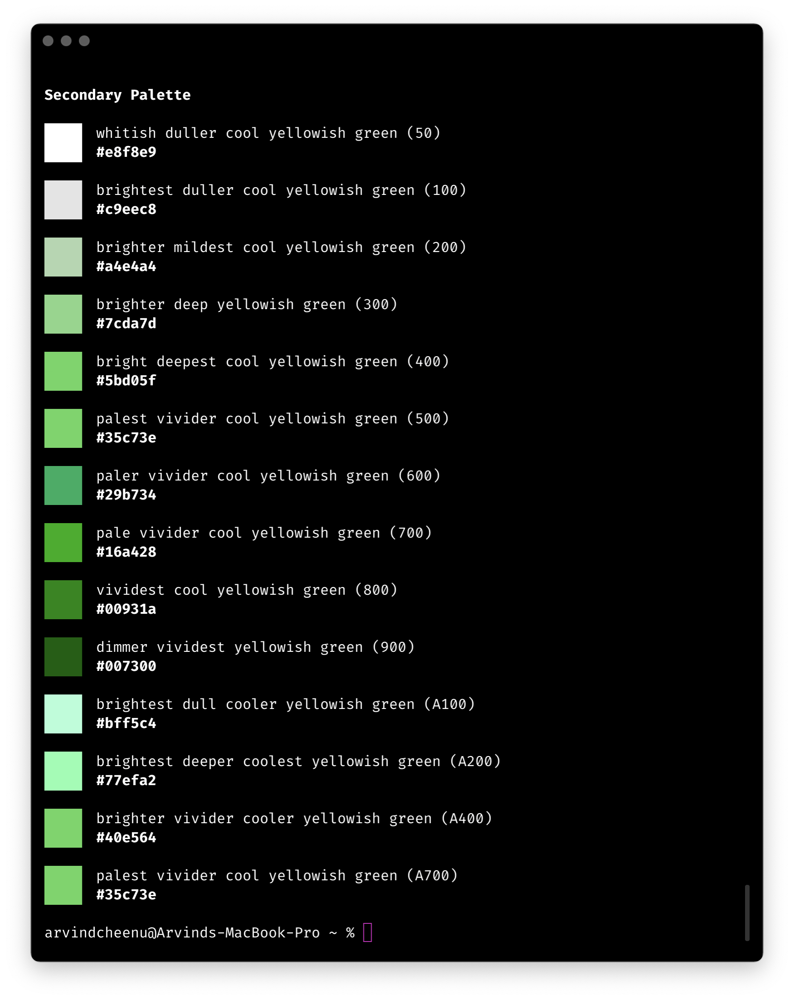
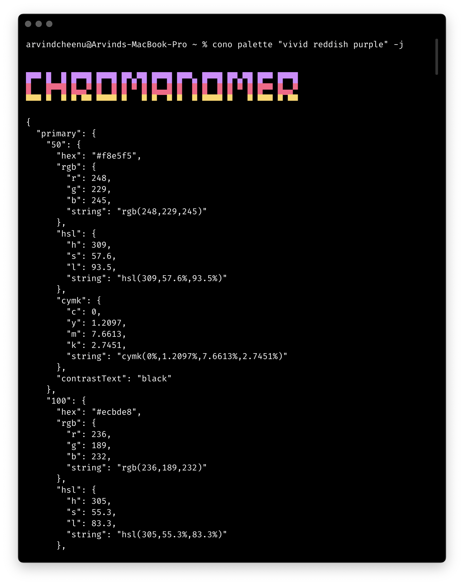
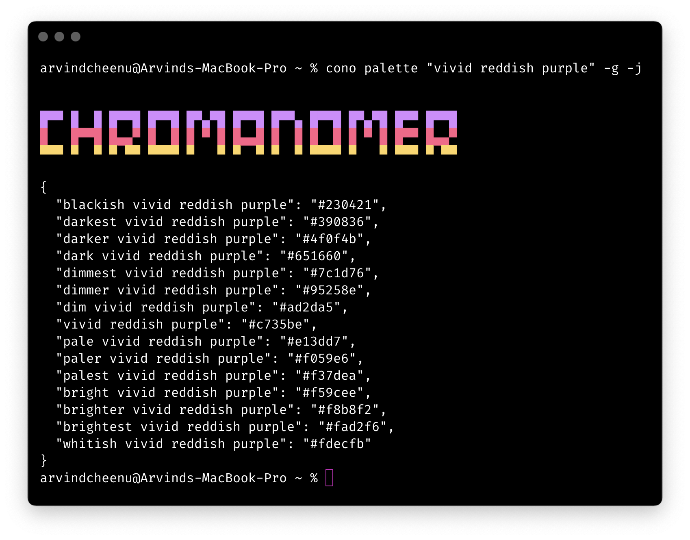

# 🕹️ Command Line Api

- [🕹️ **Command Line Api**](#%EF%B8%8F-command-line-api)
    - [🚸 **Usage Documentation**](#-usage-documentation)
        - [#️⃣ `cono` usage](#%EF%B8%8F%E2%83%A3-cono-usage)
        - [#️⃣ `cono color` usage](#%EF%B8%8F%E2%83%A3-cono-color-usage)
        - [#️⃣ `cono nearest` usage](#%EF%B8%8F%E2%83%A3-cono-nearest-usage)
        - [#️⃣ `cono run` usage](#%EF%B8%8F%E2%83%A3-cono-run-usage)
        - [#️⃣ `cono palette` usage](#%EF%B8%8F%E2%83%A3-cono-palette-usage)
    - [ℹ️ **Usage Examples**](#ℹ%EF%B8%8F-usage-examples)
        - [#️⃣ For `cono color`](#%EF%B8%8F%E2%83%A3-for-cono-color)
        - [#️⃣ For `cono nearest`](#%EF%B8%8F%E2%83%A3-for-cono-nearest)
        - [#️⃣ For `cono palette`](#%EF%B8%8F%E2%83%A3-for-cono-palette)

<!-- /TOC -->

## 🚸 Usage Documentation
### #️⃣ `cono` usage
```shell
cono <command>

Commands:
  cono palette <name> [--blindness]         Generate Harmonic Color Palettes
  [--json] [--greedy]                       from Cono Color(s).
  cono nearest <hex> [--colorspace]         Get the Closest Cono Color Name for
  [--blindness]                             the given Hex Color.
  cono color <name> [--colorspace]          Retrieve color information for given
  [--blindness]                             a Cono Color Name.
  cono run <generator> [--language]         Run generators builtin with Cono.

Options:
  -h, --help     Show help                                             [boolean]
  -v, --version  Show version number                                   [boolean]

Made with ❤️ by Arvind Srinivasan.
Licensed under Apache-2.0.
```
### #️⃣ `cono color` usage
```shell
cono color <name> [--colorspace] [--blindness]

Retrieve color information for given a Cono Color Name.

Positionals:
  n, name               Color Name following Cono's naming conventions. [string]
  c, space, colorspace  Name of the CSS Colorspace to convert to.
  [string] [choices: "all", "hex", "rgb", "hsl", "hwb", "cymk"] [default: "all"]
  b, blind, blindness   Name of the Blindness Type you want to emulate.
                [string] [choices: "protanomaly", "protanopia", "deuteranomaly",
  "deuteranopia", "tritanomaly", "tritanopia", "achromatomaly", "achromatopsia"]

Options:
  -h, --help     Show help                                             [boolean]
  -v, --version  Show version number                                   [boolean]
```
### #️⃣ `cono nearest` usage
```shell
cono nearest <hex> [--colorspace] [--blindness]

Get the Closest Cono Color Name for the given Hex Color.

Positionals:
  x, hex                6-Digit Hash Prefixed Hex Color to Find Nearest for.
                                                                        [string]
  c, space, colorspace  Name of the CSS Colorspace to convert to.
  [string] [choices: "all", "hex", "rgb", "hsl", "hwb", "cymk"] [default: "all"]
  b, blind, blindness   Name of the Blindness Type you want to emulate.
                [string] [choices: "protanomaly", "protanopia", "deuteranomaly",
  "deuteranopia", "tritanomaly", "tritanopia", "achromatomaly", "achromatopsia"]

Options:
  -h, --help     Show help                                             [boolean]
  -v, --version  Show version number                                   [boolean]
```
### #️⃣ `cono run` usage
```shell
cono run <generator> [--language]

Run generators builtin with Cono.

Positionals:
  g, gen, generator  Name the Generator you choose to run.
                                             [string] [choices: "color", "scss"]
  l, lang, language  Enter 2-letter ISO 639-1 Code for the Language you wish to
                     use for naming.
                                  [string] [choices: "en", "ta"] [default: "en"]

Options:
  -h, --help     Show help                                             [boolean]
  -v, --version  Show version number                                   [boolean]
```
### #️⃣ `cono palette` usage
```shell
cono palette <name> [--blindness] [--json] [--greedy]

Generate Harmonic Color Palettes from Cono Color(s).

Positionals:
  n, name              Color Name following Cono's naming conventions.  [string]
  b, blind, blindness  Name of the Blindness Type you want to emulate.
                [string] [choices: "protanomaly", "protanopia", "deuteranomaly",
  "deuteranopia", "tritanomaly", "tritanopia", "achromatomaly", "achromatopsia"]
  j, json              When set, returns json instead of visual representation.
                                                      [boolean] [default: false]
  g, greedy            When set, matches all colors containing the string.
                                                      [boolean] [default: false]

Options:
  -h, --help     Show help                                             [boolean]
  -v, --version  Show version number                                   [boolean]
```
## ℹ️ Usage Examples
### #️⃣ For `cono color`




### #️⃣ For `cono nearest`



### #️⃣ For `cono palette`





