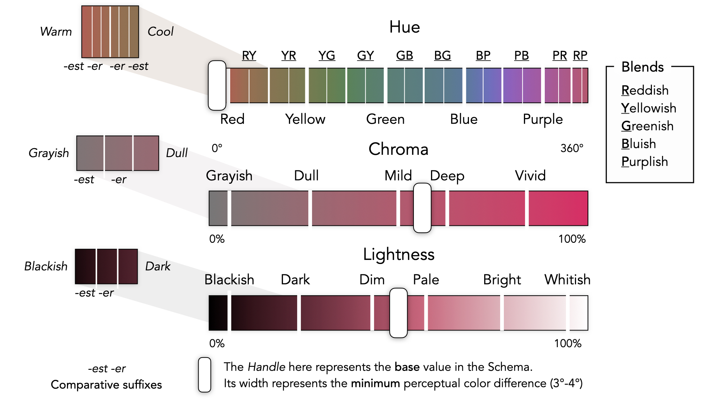

# Summary

The persistent efforts in defining better and more intuitive ways of comprehending color have led to vast advances in the field of color research. Following the introduction of the *CIE Color Model*, several models of color representation were proposed broadly based on either visual perception[@describingcolors_2019; @Fairchild_2013] or biological processes. 

Since these models followed diverse methods of color representation, a unified system of mapping perceived colors with their counterparts in other colorspaces through natural language was necessary. Most attempts at standardising Color Naming Systems were either too broad [@fuzzyncs_2006], with steep learnability curves, or too narrow [@iscc_1955; @colorbnf_1982], offering names to only a small gamut of colors. Moreover, these naming systems did not attribute ample attention to the linguistic dimensions of color[@berlin1991basic], thus failing to be a comprehensive solution. 

# Statement of Need

The *Chromanomer* Javascript Library attempts to address these shortcomings by implementing a better color naming system that names a broader gamut of colors than any existing open-source solution while maintaining a shallow learning curve. By adopting an object-based modeling approach, this library is built with accessibility, customisability and internationalization in mind. Through the use of CSS preprocessors like Sass, the generation of colors is automated, thus enabling ease of use. *Chromanomer*'s concise API is functional and chainable by design. Ranging from Color conversions and Lookups to Palette Generation[@matercolors] and Transformations for Color Blindness[@colorblind], *Chromanomer* offers a consummate collection of methods for the most pressing use-cases. Furthermore, *Chromanomer* also provides a colorful commandline interface visually representing colors as named swatches.  

*Chromanomer* is a software designed with the needs of Data Visualisation Specialists and UX Researchers in mind. Notably, Graphic Designers and Data Visualisation Specialists can incorporate colors into their designs with confidence and ease irrespective of their varying degrees of visual disability. API Implementation for Palette Generation and Greedy Selection are deliberately minimal and extensible by design to ensure its ease of use. UX Researchers, on the other hand, are now offered additional context that helps them arrive at substantial insights into the design process of visually impaired users, if this tool can be incorporated in a product offering that is being tested. In brief, the ultimate goal of *Chromanomer* is to **make access to color universal.**

# Proposed Solution

*Chromanomer* works by building over the *HSLUV* Color Space[@hsluv] that maps the boundaries of *RGB* Color Space[@rgb2cielab_1997] to the perceptually uniform *CIELCHuv* Color Space[@uniformcolorspace_1994], thus circumventing the problem of unbounded chroma. The trade-off of using this approach is that chromaticity does not conform to perceptual uniformity. 

The following schema was arrived at by extracting the best traits from existing naming solutions (such as the Five Color Primaries in *Munsell Naming System*[@ncs_1981]) and selecting linguistically universal color terms (See \autoref{fig:schematic}). The incorporation of Adjective terms also enhances the learnability and composability by reducing the potential number of color terms to remember.

# Related Works

* **HSLuv**: An Implementation[@hsluv_git] that extends CIELUV with a new saturation component that allows you to span all the available chroma as a neat percentage.
* **Name-that-color**: A Javascript Package[@ntc_2007] that broadly names all hex colors within 1500+ color categories. The tool also has a Color-Blind[@Flueck] Version.
* **MagnaView**: A System for Multivariate data visualization that utilizes natural language-based palette generation[@Gencolorpalettes_2008].

# References

